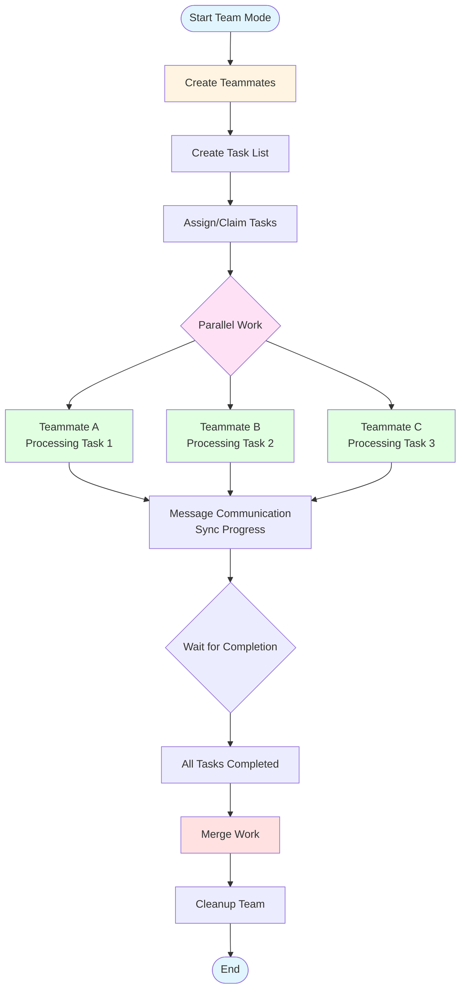

# Snow CLI User Guide - Team Mode

Team Mode (Multi-Agent Collaboration) is an advanced feature of Snow CLI that allows you to launch multiple AI teammates working independently simultaneously, coordinating through a shared task list to achieve true parallel development.

## What is Team Mode

Team Mode allows you to create a team of AI developers where each teammate:

- Works in an independent Git worktree without interference
- Coordinates分工 through a shared task list
- Can communicate with each other to synchronize progress
- Merges work back to the main branch upon completion

### Applicable Scenarios

- **Large-scale refactoring projects**: Split tasks among multiple teammates for parallel processing
- **Full-stack development**: Frontend, backend, and testing proceed simultaneously
- **Code review**: Dedicated teammates responsible for review and quality assurance
- **Documentation writing**: Multi-language documentation written in parallel
- **Complex feature development**: Modular decomposition with each teammate responsible for different modules

## Core Concepts of Team Mode

### Teammate

Each teammate is an independent AI instance with:

- **Independent Git worktree**: Located in `.snow/worktrees/` directory
- **Isolated context**: Separated from the main workflow and other teammates
- **Dedicated role**: Can assign different roles (e.g., Frontend Developer, QA Engineer)
- **Full tool access**: Can use all Snow CLI tools

### Shared Task List

The team coordinates work using a shared task list:

- **Task creation**: Can pre-create tasks or add dynamically
- **Task assignment**: Can assign to specific teammates or let teammates claim actively
- **Dependency management**: Tasks can have dependencies to ensure execution order
- **Status tracking**: Real-time view of task progress

### Message Communication

Teammates can communicate through the messaging system:

- **Unicast**: Send messages to specific teammates
- **Broadcast**: Send messages to all teammates
- **Auto-sync**: Teammates notify the team when work is completed

## Team Mode Workflow



### Workflow Description

1. **Create Teammates**: Use `spawn_teammate` to create required teammates
2. **Create Tasks**: Use `create_task` to add tasks to the shared list
3. **Assign Tasks**: Teammates claim actively or are assigned
4. **Parallel Execution**: Teammates work independently in their respective worktrees
5. **Message Communication**: Coordinate through the messaging system when needed
6. **Wait for Completion**: Wait for all teammates to complete tasks
7. **Merge Work**: Merge each teammate's work into the main branch
8. **Cleanup Team**: Shutdown teammates and clean up worktrees

## Command Reference

### Create Teammate: spawn_teammate

Create a new AI teammate, each with their own Git worktree.

```typescript
spawn_teammate({
  name: "frontend",           // Teammate name (short descriptive)
  prompt: "Task description...", // Complete task prompt
  require_plan_approval: true // Whether to require plan approval before execution (optional)
})
```

**Examples**:

```typescript
// Create a frontend development teammate
spawn_teammate({
  name: "frontend",
  prompt: "Responsible for implementing the frontend code for the user login page. Use React + TypeScript, need to include form validation and error handling. Project path: src/pages/login/",
  require_plan_approval: true
})

// Create a testing teammate
spawn_teammate({
  name: "tester",
  prompt: "Write unit tests and integration tests for the login feature. Use Jest + React Testing Library, coverage requirement above 80%."
})
```

### Create Task: create_task

Add tasks to the shared task list.

```typescript
create_task({
  title: "Task Title",        // Short task title
  description: "Detailed description...", // Task specifics
  assignee_name: "frontend",  // Assign to which teammate (optional)
  dependencies: ["task-id-1"] // List of dependent task IDs (optional)
})
```

**Examples**:

```typescript
// Create standalone task
create_task({
  title: "Implement Login Page",
  description: "Create login form component, include email and password input, add form validation",
  assignee_name: "frontend"
})

// Create task with dependencies
create_task({
  title: "Write Login Tests",
  description: "Write unit tests for login feature",
  assignee_name: "tester",
  dependencies: ["task-abc-123"]  // Wait for login page completion
})
```

### Update Task: update_task

Update task status or reassign.

```typescript
update_task({
  task_id: "task-abc-123",
  status: "in_progress",      // pending | in_progress | completed
  assignee_name: "backend"    // Reassign to another teammate
})
```

### List Tasks: list_tasks

View all tasks and their status.

```typescript
list_tasks({})
```

**Return Example**:

```
Task List:
┌─────────┬──────────────────────┬─────────────┬────────────────┐
│ ID      │ Title                │ Status      │ Assignee       │
├─────────┼──────────────────────┼─────────────┼────────────────┤
│ task-1  │ Implement Login Page │ completed   │ frontend       │
│ task-2  │ Write Login Tests    │ in_progress │ tester         │
│ task-3  │ API Integration      │ pending     │ -              │
└─────────┴──────────────────────┴─────────────┴────────────────┘
```

### List Teammates: list_teammates

View all currently running teammates.

```typescript
list_teammates({})
```

**Return Example**:

```
Teammate List:
┌──────────┬────────────────┬─────────┬────────────────────────────────┐
│ MemberID │ Name           │ Status  │ Current Task                   │
├──────────┼────────────────┼─────────┼────────────────────────────────┤
│ mem-abc  │ frontend       │ working │ Implement Login Page           │
│ mem-def  │ tester         │ working │ Write Login Tests              │
│ mem-ghi  │ backend        │ standby │ Waiting for new task           │
└──────────┴────────────────┴─────────┴────────────────────────────────┘
```

### Send Message: message_teammate

Send a message to a specific teammate.

```typescript
message_teammate({
  target_id: "mem-abc",       // Teammate ID or name
  content: "Frontend page is complete, testing can begin"
})
```

### Broadcast Message: broadcast_to_team

Broadcast a message to all teammates.

```typescript
broadcast_to_team({
  content: "Attention all teammates: Project requirements have been updated, please check the documentation"
})
```

### Wait for Completion: wait_for_teammates

Block and wait for all teammates to complete work.

```typescript
wait_for_teammates({
  timeout_seconds: 600        // Timeout in seconds, default 600
})
```

**Note**: This command blocks the current flow until all teammates enter `standby` status or timeout.

### Merge Teammate Work: merge_teammate_work

Merge a specific teammate's work into the main branch.

```typescript
merge_teammate_work({
  name: "frontend",
  strategy: "manual"          // manual | theirs | ours | auto
})
```

**Merge Strategies**:

- `manual` (default): Manually resolve conflicts
- `theirs`: Automatically accept all teammate's changes
- `ours`: Automatically keep main branch changes
- `auto`: Try normal merge, auto-accept teammate's version on conflicts

### Merge All Work: merge_all_teammate_work

Merge all teammates' work into the main branch.

```typescript
merge_all_teammate_work({
  strategy: "manual"
})
```

### Shutdown Teammate: shutdown_teammate

Shutdown a specific teammate.

```typescript
shutdown_teammate({
  target_id: "mem-abc",
  reason: "Task completed"    // Shutdown reason (optional)
})
```

**Note**: Teammates cannot shutdown themselves, must be controlled by the team lead.

### Cleanup Team: cleanup_team

Cleanup the team, remove all Git worktrees.

```typescript
cleanup_team({})
```

**Important**: Before executing this command, you must:
1. Shutdown all teammates
2. Merge all work you want to keep

## Workflow Examples

### Example 1: Full-Stack Feature Development

```typescript
// 1. Create development team
spawn_teammate({
  name: "backend",
  prompt: "Responsible for designing and implementing user authentication API. Requirements: 1) Login endpoint 2) Registration endpoint 3) JWT token generation 4) Password encryption. Use Express + Prisma.",
  require_plan_approval: true
})

spawn_teammate({
  name: "frontend",
  prompt: "Responsible for implementing frontend for login and registration pages. Use React + TypeScript + Tailwind CSS, need to integrate with backend API."
})

spawn_teammate({
  name: "tester",
  prompt: "Responsible for writing complete test suite. Includes: 1) Backend API tests 2) Frontend component tests 3) Integration tests. Coverage requirement 90%."
})

// 2. Create task list
create_task({
  title: "Design Database Models",
  description: "Design user table structure, including email, password hash, creation time, etc.",
  assignee_name: "backend"
})

create_task({
  title: "Implement Auth API",
  description: "Implement login, registration, token refresh endpoints",
  assignee_name: "backend"
})

create_task({
  title: "Implement Login Page",
  description: "Create login page UI and form logic",
  assignee_name: "frontend"
})

create_task({
  title: "Write Backend Tests",
  description: "Write unit and integration tests for auth API",
  assignee_name: "tester",
  dependencies: ["task-backend-api"]  // Depends on backend API completion
})

// 3. Wait for all teammates to complete
wait_for_teammates({ timeout_seconds: 1800 })

// 4. Merge all work
merge_all_teammate_work({ strategy: "manual" })

// 5. Cleanup team
cleanup_team({})
```

### Example 2: Code Refactoring Project

```typescript
// Create multiple refactoring teammates for different modules
spawn_teammate({
  name: "refactor-utils",
  prompt: "Refactor all utility functions in the utils directory. Goals: 1) Add type definitions 2) Unify error handling 3) Add JSDoc comments"
})

spawn_teammate({
  name: "refactor-components",
  prompt: "Refactor React components in the components directory. Goals: 1) Convert to function components 2) Use TypeScript 3) Optimize performance"
})

spawn_teammate({
  name: "refactor-api",
  prompt: "Refactor API layer code. Goals: 1) Unify request encapsulation 2) Add request/response interceptors 3) Improve error handling"
})

// Create tasks
create_task({ title: "Refactor Utility Functions", assignee_name: "refactor-utils" })
create_task({ title: "Refactor Components", assignee_name: "refactor-components" })
create_task({ title: "Refactor API Layer", assignee_name: "refactor-api" })

// Wait and merge
wait_for_teammates({ timeout_seconds: 1200 })
merge_all_teammate_work({ strategy: "auto" })
cleanup_team({})
```

### Example 3: Multi-language Documentation

```typescript
// Create multiple documentation teammates
spawn_teammate({
  name: "doc-zh",
  prompt: "Write Chinese user documentation. Content includes: Installation Guide, Quick Start, API Reference, FAQ."
})

spawn_teammate({
  name: "doc-en",
  prompt: "Write English user documentation. Content corresponds to Chinese documentation, keep synchronized updates."
})

spawn_teammate({
  name: "doc-ja",
  prompt: "Write Japanese user documentation. Content corresponds to Chinese documentation, keep synchronized updates."
})

// Wait for completion
wait_for_teammates({ timeout_seconds: 900 })

// Merge each teammate's work separately
merge_teammate_work({ name: "doc-zh", strategy: "manual" })
merge_teammate_work({ name: "doc-en", strategy: "manual" })
merge_teammate_work({ name: "doc-ja", strategy: "manual" })

cleanup_team({})
```

## Best Practices

### 1. Reasonable Task Splitting

- Break large tasks into independent smaller tasks
- Each task should have clear completion criteria
- Avoid circular dependencies between tasks

### 2. Clear Role Definition

When creating teammates, provide detailed and clear prompts:

```typescript
spawn_teammate({
  name: "backend",
  prompt: `You are a backend development expert.

Task: Implement user authentication system

Specific requirements:
1. Use Express.js + Prisma + PostgreSQL
2. Implement registration, login, logout endpoints
3. Use bcrypt for password encryption
4. Use JWT for authentication
5. Add input validation and error handling
6. Write API documentation

Project path: /src/server
Database config: Check .env file

Notify testing teammate upon completion.`
})
```

### 3. Proper Use of Dependency Management

For tasks with dependencies, explicitly set dependency relationships:

```typescript
// Create prerequisite task first
const task1 = create_task({
  title: "Design Database Models",
  assignee_name: "backend"
})

// Create dependent task
const task2 = create_task({
  title: "Implement API Endpoints",
  assignee_name: "backend",
  dependencies: [task1.task_id]  // Depends on task1
})
```

### 4. Timely Communication and Coordination

Keep teammates synchronized through the messaging system:

```typescript
// Backend notifies frontend after API completion
message_teammate({
  target_id: "frontend",
  content: "API deployed at http://localhost:3000/api, API docs at /docs/api.md"
})

// Broadcast important information
broadcast_to_team({
  content: "Project dependencies updated, please re-run npm install"
})
```

### 5. Careful Merge Handling

Check each teammate's work before merging:

```typescript
// Check all task status first
list_tasks({})

// Merge one by one, manually resolving conflicts
merge_teammate_work({ name: "frontend", strategy: "manual" })
merge_teammate_work({ name: "backend", strategy: "manual" })

// Or use auto strategy for automatic merging
merge_all_teammate_work({ strategy: "auto" })
```

### 6. Proper Use of Plan Approval

For complex tasks, enable plan approval to ensure correct direction:

```typescript
spawn_teammate({
  name: "architect",
  prompt: "Design overall system architecture...",
  require_plan_approval: true  // Requires approval for execution plan
})
```

The teammate will submit an execution plan first, which you need to approve before proceeding.

## FAQ

### Q: What's the difference between Team Mode and Sub-Agents?

A: Main differences:

| Feature | Sub-Agent | Team Mode |
|---------|-----------|-----------|
| Workspace | Independent context | Independent Git worktree |
| Parallelism | Serial invocation | True parallel |
| Persistence | Temporary | Persistent worktree |
| Collaboration | Unidirectional | Bidirectional communication |
| Merge | Return results | Git merge |

### Q: How many teammates can be created simultaneously?

A: There is no theoretical limit, but it's recommended to control within 3-5 based on task complexity and machine performance to ensure efficiency.

### Q: Can teammates share code with each other?

A: Teammates work independently in their respective worktrees and cannot directly access each other's code. Sharing only occurs after merging to the main branch.

### Q: How to check teammate work progress?

A: You can use the following methods:
1. `list_teammates` to view teammate status
2. `list_tasks` to view task progress
3. Use `message_teammate` to ask teammates about progress

### Q: What if there's a conflict in teammate work?

A: Use `merge_teammate_work` with `manual` strategy, the system will enter merge state where you can manually resolve conflicts before committing.

### Q: Can new teammates be added midway?

A: Yes, you can use `spawn_teammate` at any time to create new teammates and assign tasks.

### Q: Can teammates modify the main branch?

A: No, teammates can only work in their own worktrees. Changes need to be applied to the main branch through merge operations.

### Q: How to terminate a running teammate?

A: Use `shutdown_teammate` command to close a specific teammate. Note: Teammates cannot close themselves.

## Related Documentation

- [Sub-Agent Configuration](./05.Sub-Agent%20Configuration.md) - Learn about sub-agent usage
- [Async Task Management](./15.Async%20Task%20Management.md) - Background task management
- [Hooks Configuration](./07.Hooks%20Configuration.md) - Git operation hooks configuration
