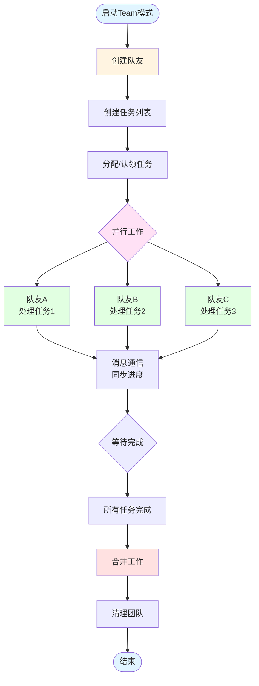

# Snow CLI 使用文档——Team模式指南

Team模式（多智能体协作）是 Snow CLI 的高级功能，允许你同时启动多个独立工作的 AI 队友，通过共享任务列表协调工作，实现真正的并行开发。

## 什么是Team模式

Team模式允许你创建一支 AI 开发团队，每个队友：

- 在独立的 Git 工作树中工作，互不干扰
- 通过共享任务列表协调分工
- 可以相互通信，同步进度
- 完成后将工作合并回主分支

### 适用场景

- **大型重构项目**：将任务拆分给多个队友并行处理
- **全栈开发**：前端、后端、测试同时进行
- **代码审查**：专门队友负责审查和质量保证
- **文档编写**：多语言文档并行撰写
- **复杂功能开发**：模块化分解，各 teammate 负责不同模块

## Team模式核心概念

### 队友（Teammate）

每个队友是一个独立的 AI 实例，拥有：

- **独立的 Git 工作树**：在 `.snow/worktrees/` 目录下
- **独立的上下文**：与主流程和其他队友隔离
- **专属角色**：可以指定不同角色（如前端开发、测试工程师）
- **完整工具访问**：可以使用所有 Snow CLI 工具

### 共享任务列表

团队使用共享的任务列表协调工作：

- **任务创建**：可以预先创建任务或动态添加
- **任务分配**：可以指定给特定队友，也可以让队友主动认领
- **依赖管理**：任务可以设置依赖关系，确保执行顺序
- **状态追踪**：实时查看任务进度

### 消息通信

队友之间可以通过消息系统通信：

- **单播**：向特定队友发送消息
- **广播**：向所有队友发送消息
- **自动同步**：队友完成工作后会通知团队

## Team模式工作流程



### 工作流程说明

1. **创建队友**：使用 `spawn_teammate` 创建需要的队友
2. **创建任务**：使用 `create_task` 添加任务到共享列表
3. **分配任务**：队友主动认领或指定分配
4. **并行执行**：队友在各自的工作树中独立工作
5. **消息通信**：需要时通过消息系统协调
6. **等待完成**：等待所有队友完成任务
7. **合并工作**：将各队友的工作合并到主分支
8. **清理团队**：关闭队友并清理工作树

## 命令详解

### 创建队友：spawn_teammate

创建一个新的 AI 队友，每个队友有自己的 Git 工作树。

```typescript
spawn_teammate({
  name: "frontend",           // 队友名称（简短描述性）
  prompt: "任务描述...",       // 完整的任务提示词
  require_plan_approval: true // 是否需要在执行前审批计划（可选）
})
```

**示例**：

```typescript
// 创建一个前端开发队友
spawn_teammate({
  name: "frontend",
  prompt: "负责实现用户登录页面的前端代码。使用 React + TypeScript，需要包含表单验证和错误处理。项目路径：src/pages/login/",
  require_plan_approval: true
})

// 创建一个测试队友
spawn_teammate({
  name: "tester",
  prompt: "为登录功能编写单元测试和集成测试。使用 Jest + React Testing Library，覆盖率要求 80%以上。"
})
```

### 创建任务：create_task

在共享任务列表中添加任务。

```typescript
create_task({
  title: "任务标题",           // 简短的任务标题
  description: "详细描述...",   // 任务的具体内容
  assignee_name: "frontend",   // 指定给哪个队友（可选）
  dependencies: ["task-id-1"]  // 依赖的任务ID列表（可选）
})
```

**示例**：

```typescript
// 创建独立任务
create_task({
  title: "实现登录页面",
  description: "创建登录表单组件，包含邮箱和密码输入，添加表单验证",
  assignee_name: "frontend"
})

// 创建有依赖的任务
create_task({
  title: "编写登录测试",
  description: "为登录功能编写单元测试",
  assignee_name: "tester",
  dependencies: ["task-abc-123"]  // 等待登录页面完成
})
```

### 更新任务：update_task

更新任务状态或重新分配。

```typescript
update_task({
  task_id: "task-abc-123",
  status: "in_progress",       // pending | in_progress | completed
  assignee_name: "backend"     // 重新分配给其他队友
})
```

### 查看任务列表：list_tasks

查看所有任务及其状态。

```typescript
list_tasks({})
```

**返回示例**：

```
任务列表：
┌─────────┬──────────────────┬─────────────┬────────────────┐
│ ID      │ 标题             │ 状态        │ 负责人         │
├─────────┼──────────────────┼─────────────┼────────────────┤
│ task-1  │ 实现登录页面     │ completed   │ frontend       │
│ task-2  │ 编写登录测试     │ in_progress │ tester         │
│ task-3  │ API接口对接      │ pending     │ -              │
└─────────┴──────────────────┴─────────────┴────────────────┘
```

### 查看队友：list_teammates

查看当前运行的所有队友。

```typescript
list_teammates({})
```

**返回示例**：

```
队友列表：
┌──────────┬────────────────┬─────────────┬────────────────────────────┐
│ 成员ID   │ 名称           │ 状态        │ 当前任务                   │
├──────────┼────────────────┼─────────────┼────────────────────────────┤
│ mem-abc  │ frontend       │ working     │ 实现登录页面               │
│ mem-def  │ tester         │ working     │ 编写登录测试               │
│ mem-ghi  │ backend        │ standby     │ 等待新任务                 │
└──────────┴────────────────┴─────────────┴────────────────────────────┘
```

### 发送消息：message_teammate

向特定队友发送消息。

```typescript
message_teammate({
  target_id: "mem-abc",       // 队友ID或名称
  content: "前端页面已经完成，可以开始测试了"
})
```

### 广播消息：broadcast_to_team

向所有队友广播消息。

```typescript
broadcast_to_team({
  content: "所有队友注意：项目需求有更新，请查看文档"
})
```

### 等待完成：wait_for_teammates

阻塞并等待所有队友完成工作。

```typescript
wait_for_teammates({
  timeout_seconds: 600        // 超时时间（秒），默认600秒
})
```

**注意**：此命令会阻塞当前流程，直到所有队友进入 `standby` 状态或超时。

### 合并队友工作：merge_teammate_work

合并特定队友的工作到主分支。

```typescript
merge_teammate_work({
  name: "frontend",
  strategy: "manual"          // manual | theirs | ours | auto
})
```

**合并策略**：

- `manual`（默认）：手动解决冲突
- `theirs`：自动接受队友的所有更改
- `ours`：自动保留主分支的更改
- `auto`：尝试正常合并，冲突时自动接受队友版本

### 合并所有工作：merge_all_teammate_work

合并所有队友的工作到主分支。

```typescript
merge_all_teammate_work({
  strategy: "manual"
})
```

### 关闭队友：shutdown_teammate

关闭特定队友。

```typescript
shutdown_teammate({
  target_id: "mem-abc",
  reason: "任务已完成"        // 关闭原因（可选）
})
```

**注意**：队友不能自行关闭，必须由团队负责人控制。

### 清理团队：cleanup_team

清理团队，移除所有 Git 工作树。

```typescript
cleanup_team({})
```

**重要**：执行此命令前必须：
1. 关闭所有队友
2. 合并所有需要保留的工作

## 工作流示例

### 示例1：全栈功能开发

```typescript
// 1. 创建开发团队
spawn_teammate({
  name: "backend",
  prompt: "负责设计和实现用户认证API。需要：1）登录接口 2）注册接口 3）JWT token生成 4）密码加密存储。使用 Express + Prisma。",
  require_plan_approval: true
})

spawn_teammate({
  name: "frontend",
  prompt: "负责实现登录和注册页面的前端。使用 React + TypeScript + Tailwind CSS，需要与后端API对接。"
})

spawn_teammate({
  name: "tester",
  prompt: "负责编写完整的测试套件。包括：1）后端API测试 2）前端组件测试 3）集成测试。覆盖率要求90%。"
})

// 2. 创建任务列表
create_task({
  title: "设计数据库模型",
  description: "设计用户表结构，包含邮箱、密码哈希、创建时间等字段",
  assignee_name: "backend"
})

create_task({
  title: "实现认证API",
  description: "实现登录、注册、token刷新等接口",
  assignee_name: "backend"
})

create_task({
  title: "实现登录页面",
  description: "创建登录页面UI和表单逻辑",
  assignee_name: "frontend"
})

create_task({
  title: "编写后端测试",
  description: "为认证API编写单元测试和集成测试",
  assignee_name: "tester",
  dependencies: ["task-backend-api"]  // 依赖后端API完成
})

// 3. 等待所有队友完成
wait_for_teammates({ timeout_seconds: 1800 })

// 4. 合并所有工作
merge_all_teammate_work({ strategy: "manual" })

// 5. 清理团队
cleanup_team({})
```

### 示例2：代码重构项目

```typescript
// 创建多个重构队友，分别负责不同模块
spawn_teammate({
  name: "refactor-utils",
  prompt: "重构 utils 目录下的所有工具函数。目标：1）添加类型定义 2）统一错误处理 3）添加 JSDoc 注释"
})

spawn_teammate({
  name: "refactor-components",
  prompt: "重构 components 目录下的 React 组件。目标：1）转换为函数组件 2）使用 TypeScript 3）优化性能"
})

spawn_teammate({
  name: "refactor-api",
  prompt: "重构 API 层代码。目标：1）统一请求封装 2）添加请求/响应拦截器 3）完善错误处理"
})

// 创建任务
create_task({ title: "重构工具函数", assignee_name: "refactor-utils" })
create_task({ title: "重构组件", assignee_name: "refactor-components" })
create_task({ title: "重构API层", assignee_name: "refactor-api" })

// 等待并合并
wait_for_teammates({ timeout_seconds: 1200 })
merge_all_teammate_work({ strategy: "auto" })
cleanup_team({})
```

### 示例3：多语言文档编写

```typescript
// 创建多个文档编写队友
spawn_teammate({
  name: "doc-zh",
  prompt: "编写中文用户文档。内容包括：安装指南、快速入门、API参考、常见问题。"
})

spawn_teammate({
  name: "doc-en",
  prompt: "编写英文用户文档。内容与中文文档对应，保持同步更新。"
})

spawn_teammate({
  name: "doc-ja",
  prompt: "编写日文用户文档。内容与中文文档对应，保持同步更新。"
})

// 等待完成
wait_for_teammates({ timeout_seconds: 900 })

// 分别合并每个队友的工作
merge_teammate_work({ name: "doc-zh", strategy: "manual" })
merge_teammate_work({ name: "doc-en", strategy: "manual" })
merge_teammate_work({ name: "doc-ja", strategy: "manual" })

cleanup_team({})
```

## 最佳实践

### 1. 合理拆分任务

- 将大型任务拆分为独立的小任务
- 每个任务应该有明确的完成标准
- 避免任务之间产生循环依赖

### 2. 清晰的角色定义

创建队友时，提供详细明确的提示词：

```typescript
spawn_teammate({
  name: "backend",
  prompt: `你是一个后端开发专家。

任务：实现用户认证系统

具体要求：
1. 使用 Express.js + Prisma + PostgreSQL
2. 实现注册、登录、登出接口
3. 使用 bcrypt 进行密码加密
4. 使用 JWT 进行身份验证
5. 添加输入验证和错误处理
6. 编写 API 文档

项目路径：/src/server
数据库配置：查看 .env 文件

完成后通知测试队友。`
})
```

### 3. 善用依赖管理

对于有前后依赖的任务，明确设置依赖关系：

```typescript
// 先创建前置任务
const task1 = create_task({
  title: "设计数据库模型",
  assignee_name: "backend"
})

// 后创建依赖任务
const task2 = create_task({
  title: "实现API接口",
  assignee_name: "backend",
  dependencies: [task1.task_id]  // 依赖 task1
})
```

### 4. 及时沟通协调

通过消息系统保持队友间同步：

```typescript
// 后端完成API后通知前端
message_teammate({
  target_id: "frontend",
  content: "API已部署到 http://localhost:3000/api，接口文档在 /docs/api.md"
})

// 广播重要信息
broadcast_to_team({
  content: "项目依赖有更新，请重新执行 npm install"
})
```

### 5. 谨慎处理合并

合并前检查每个队友的工作：

```typescript
// 先查看所有任务状态
list_tasks({})

// 逐个合并，手动解决冲突
merge_teammate_work({ name: "frontend", strategy: "manual" })
merge_teammate_work({ name: "backend", strategy: "manual" })

// 或者使用 auto 策略自动合并
merge_all_teammate_work({ strategy: "auto" })
```

### 6. 合理使用计划审批

对于复杂任务，启用计划审批确保方向正确：

```typescript
spawn_teammate({
  name: "architect",
  prompt: "设计系统整体架构...",
  require_plan_approval: true  // 需要审批执行计划
})
```

队友会先提交执行计划，你需要审批后才能继续执行。

## 常见问题

### Q：Team模式和子代理有什么区别？

A：主要区别：

| 特性 | 子代理 | Team模式 |
|------|--------|----------|
| 工作空间 | 独立上下文 | 独立 Git 工作树 |
| 并行性 | 串行调用 | 真正并行 |
| 持久性 | 临时 | 持久工作树 |
| 协作 | 单向 | 双向通信 |
| 合并 | 返回结果 | Git 合并 |

### Q：可以同时创建多少个队友？

A：理论上没有限制，但建议根据任务复杂度和机器性能控制在 3-5 个以内，以保证效率。

### Q：队友之间可以共享代码吗？

A：队友在各自的工作树中独立工作，不能直接访问彼此的代码。需要通过合并到主分支后才能共享。

### Q：如何查看队友的工作进度？

A：可以使用以下方式：
1. `list_teammates` 查看队友状态
2. `list_tasks` 查看任务进度
3. 通过 `message_teammate` 询问队友进度

### Q：队友的工作出现冲突怎么办？

A：使用 `merge_teammate_work` 时选择 `manual` 策略，系统会进入合并状态，你可以手动解决冲突后提交。

### Q：可以中途添加新队友吗？

A：可以，随时可以使用 `spawn_teammate` 创建新队友并分配任务。

### Q：队友可以修改主分支吗？

A：不可以，队友只能在自己的工作树中工作，需要通过合并操作才能将更改应用到主分支。

### Q：如何终止正在运行的队友？

A：使用 `shutdown_teammate` 命令关闭特定队友。注意：队友不能自行关闭。

## 相关文档

- [子代理设置](./05.子代理设置.md) - 了解子代理的使用
- [异步任务管理](./15.异步任务管理.md) - 后台任务管理
- [Hooks配置](./07.Hooks配置.md) - Git 操作钩子配置
